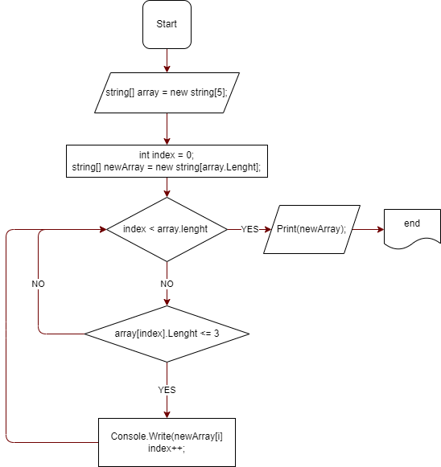

# Итоговая работа первой четверти!
## **Задача :** 

* Написать программу, которая из имеющегося массива строк формирует массив строк, длина которых <= 3 символа.

* Первоначальный массив можно ввести с клавиатуры, либо задать на старте выполнения алгоритма.

* При решении не рекомендуется пользоваться коллециями, лучше обойтись исключительно массивами.

## **Примеры :**

* ["Hello", "2", "world", ":-)"] -> ["2", ":-)"]

* ["1234", "1567", "-2"] -> ["-2"]

* ["Russia", "Denmark", "Kazan"] -> []

***

## **Рисуем блок-схему решения задачи :**

***

## **Алгоритм решения задачи :**

**1.** Для начала добавляем файл **.gitignore** 

Далее пишем первую программу :

* **Console.Clear();** 

Она очищает консоль каждый раз, когда запускаем программу через **dotnet run**.

***

**2.** Создаём первый метод, который принимает аргумент **string** и возвращает числа **int**, назовём его :

* **int Prompt(string message)**

Так же в дальнейшем этот метод поможет задавать с консоли пользователю длину одномерного массива.

***

**3.** Создаём второй метод, который создаcт массив с заданной длиной из метода **Prompt**.

* **int[] CreatArray(int lenght)**

Этот метод будет заполняться введёными значениями с консоли самим пользователем.

***

**4.** Создаём третий метод, который принимает в качестве аргумента массив из строк и распечатает его в консоли.

* **void PrintArray(string[] array)**

***

**5.** Создаём пятый метод, который принимает в качестве аргумента массив из строк.

* **string[] CheckingNumbersArray(string[] newArray)**

Этот метод проверяет условие на количество символов в строке массива и возвращает новый массив, удовлетворяющий заданному условию.